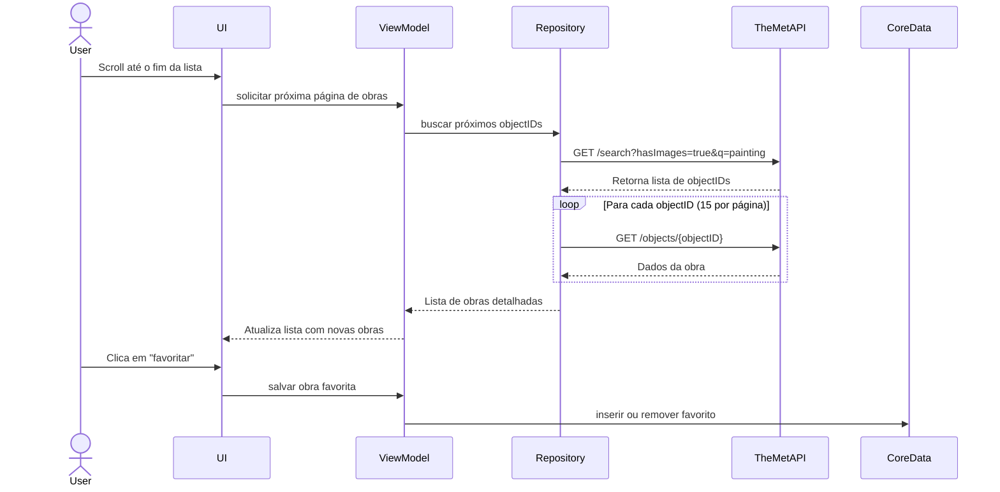

# Art Explorer - Desafio iOS com The Met Museum API

## 🌟 Objetivo

Desenvolver um aplicativo iOS em **Swift** para explorar obras de arte do acervo do Metropolitan Museum of Art (The Met), integrando-se com sua API aberta para:

* Listar obras com imagens
* Visualizar detalhes
* Marcar como favoritas

---

## 🔍 Funcionalidades Principais

1. **Listar Obras de Arte com Imagem**

   * Exibir 15 obras por vez com imagens
   * Paginação simulada ao rolar até o final da lista

2. **Favoritar Obras**

   * Marcar e desmarcar obras como favoritas
   * Exibir favoritos em uma seção separada
   * Persistência local (CoreData ou UserDefaults)

3. **Detalhes da Obra**

   * Exibir: título, artista, data, técnica, departamento e imagem

4. **Interface Amigável**

   * Design responsivo
   * Scroll suave e UX clara

5. **Testes Incluídos**

   * Testes unitários (ViewModel, Services)
   * Testes de interface com XCTest ou XCUITest

---

## 📄 Requisitos do Projeto

### 1. Integração com API

* Buscar obras usando: `GET /public/collection/v1/search?hasImages=true&q=painting`
* Buscar detalhes: `GET /public/collection/v1/objects/{objectID}`
* Paginação simulada via slicing da lista de `objectIDs`

### 2. Paginação

* Carregamento incremental de 15 em 15 objetos
* Busca paralela dos detalhes com identificadores retornados

### 3. Favoritos

* Armazenar localmente os objetos favoritados
* Permitir desmarcar favoritos e navegar para detalhes

### 4. UI/UX

* Scroll infinito (UICollectionView ou SwiftUI List)
* Indicadores de carregamento e mensagens de erro visuais
* Suporte a dark mode é um diferencial

### 5. Testes

* ViewModel com mock de serviços
* Testes de tela para favoritar e navegar

### 6. Documentação

* README contendo:

  * Como rodar o projeto (Xcode, CocoaPods/SPM)
  * Decisões arquiteturais (MVC, MVVM ou Clean)
  * Endpoints utilizados
  * Prints ou vídeos são bem-vindos

---

## 🔗 Endpoints Utilizados da API The Met

| Funcionalidade             | Endpoint                                                           |
| -------------------------- | ------------------------------------------------------------------ |
| Listar obras com imagem    | `GET /public/collection/v1/search?hasImages=true&q=painting`       |
| Buscar detalhes da obra    | `GET /public/collection/v1/objects/{objectID}`                     |
| Listar departamentos       | `GET /public/collection/v1/departments`                            |
| Buscar por departamento    | `GET /public/collection/v1/search?departmentId=11&q=portrait`      |
| Buscar por artista/cultura | `GET /public/collection/v1/search?artistOrCulture=true&q=van+gogh` |

---

## ⌚ Diagrama de Sequência (Mermaid)

---

## 📊 Requisitos Desejáveis

* Logging com `os_log` ou ferramenta equivalente
* Busca com debounce
* Filtros por artista, data, cultura
* Animações com UIKit Dynamics ou SwiftUI
* Modularização do projeto
* Deploy com TestFlight ou Demo em vídeo

---

## 📆 Entrega

1. **Fork do Repositório Base**
2. **Crie uma branch com seu nome em snake\_case** (ex: `joao_silva_souza`)
3. **Suba o projeto com commits organizados**
4. **Abra um Pull Request** com:

   * Título: `Entrega - joao_silva_souza`
   * Corpo: Nome completo, data da entrega, considerações opcionais

---

## 🎓 Licença

Os dados são fornecidos pela **The Met Museum Open Access API** sob licença [CC0 1.0 Universal](https://creativecommons.org/publicdomain/zero/1.0/).

---

## 📢 Contato

* Autor: Leandro Costa
* Email: [leandro@jaya.tech](mailto:leandro@jaya.tech)
